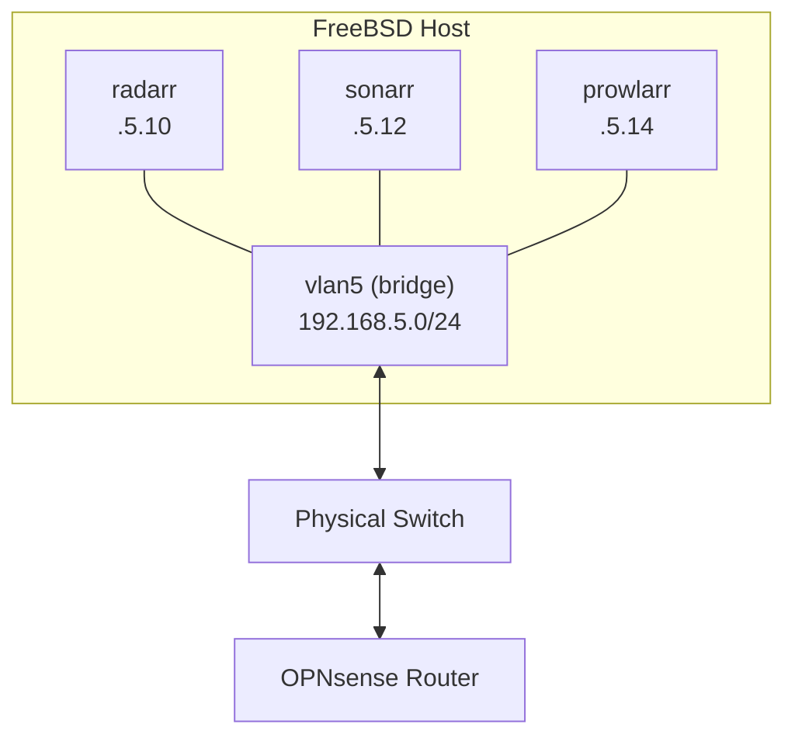
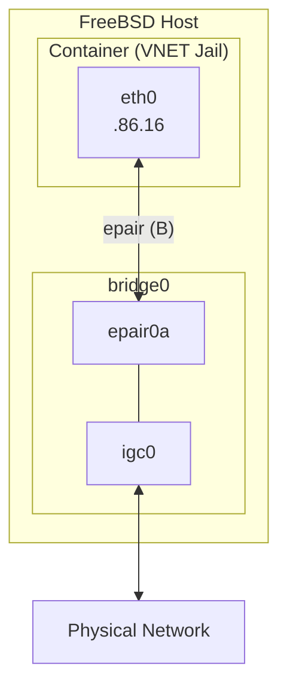

I've been running containers on FreeBSD for a while now, and I've settled into a workflow that just works. Here's how I manage everything.

## The Stack

| Component | Choice |
|-----------|--------|
| **Host OS** | FreeBSD 15 |
| **Runtime** | Podman + ocijail |
| **Orchestration** | Ansible |
| **Images** | Daemonless (FreeBSD-native) |
| **Storage** | ZFS (lz4 compression) |
| **Networking** | VNET jails + bridge |

No Docker daemon. No Linux VMs. Podman talks to ocijail, which runs containers as native FreeBSD jails.

## Directory Structure

Every service gets its config stored in `/containers/<service>/`. Simple and predictable:

```
/containers/
├── radarr/
│   └── config/
├── sonarr/
│   └── config/
├── plex/
│   └── config/
├── gitea/
│   └── config/
└── woodpecker/
    └── config/
```

When I need to back up a service, I just `zfs snapshot containers@backup`. When I need to migrate, I `zfs send` the dataset to the new host and run the playbook.

## Ansible All The Things

I don't run containers by hand. Every service has an Ansible playbook that handles the full lifecycle.

Here's the core of what deploys Radarr:

```yaml
- name: Deploy Radarr (Podman) on jupiter
  hosts: jupiter
  become: yes
  become_method: doas

  vars:
    container_name: radarr
    container_image: ghcr.io/daemonless/radarr:latest
    container_ip: 192.168.5.10
    container_mac: "0e:05:00:00:00:0a"
    container_network: vlan5
    config_path: /containers/radarr

  tasks:
    - name: Pull container image
      command: podman pull {{ container_image }}

    - name: Create container with CNI networking
      command: >
        podman run -d --name {{ container_name }}
        --network {{ container_network }}
        --ip {{ container_ip }}
        --mac-address {{ container_mac }}
        --annotation 'org.freebsd.jail.allow.mlock=true'
        -e PUID=1000 -e PGID=1000
        -v {{ config_path }}:/config
        -v /mars/tide:/tide
        -v /mars/ocean:/ocean
        --restart always
        {{ container_image }}

    - name: Wait for service to be ready
      uri:
        url: "http://{{ container_ip }}:7878/ping"
        status_code: 200
      retries: 30
      delay: 2
```

That's the actual playbook. The MAC address scheme (`0e:05:00:00:00:0a`) maps to the IP — `05` is VLAN5, `0a` is hex for `.10`. OPNsense has a DHCP reservation matching that MAC, so the container always gets the same IP.

## Networking Deep Dive

This is where FreeBSD containers get interesting. Each container is a real VNET jail with its own network stack.

### The Simple Way: CNI/bridge

On jupiter, I use Podman's CNI networking with bridge. The container gets a real IP on the VLAN:



Each container appears as a separate device on the network. No port mapping, no NAT — just real IPs.

The CNI plugins for FreeBSD aren't in the official ports tree yet. I maintain [ports in a GitHub repo](https://github.com/daemonless/freebsd-ports/tree/main/net/cni-dnsname) and the [port has been submitted upstream](https://bugs.freebsd.org/bugzilla/show_bug.cgi?id=292014), but I no longer commit to FreeBSD so it's waiting on the ports team.

### The Manual Way: VNET Injection

On saturn (my CI server), I don't have CNI configured — it's a simpler box that just runs Gitea and Woodpecker. Instead, I use manual VNET injection with epair interfaces:

```yaml
# vars: bridge_interface, container_mac, container_ip, container_gateway
- name: Configure networking (VNET Injection)
  block:
    - name: Get container jail ID
      shell: jls | grep -w {{ container_name }} | awk '{print $1}'
      register: jail_id

    - name: Create epair interface
      command: ifconfig epair create
      register: epair_created

    - name: Add epair to bridge
      command: ifconfig {{ bridge_interface }} addm {{ epair_created.stdout }}

    - name: Move epairB to jail
      command: ifconfig {{ epair_created.stdout | regex_replace('a$', 'b') }} vnet {{ jail_id.stdout }}

    - name: Configure interface inside jail
      shell: |
        jexec {{ jail_id.stdout }} ifconfig {{ epair_b }} name eth0
        jexec {{ jail_id.stdout }} ifconfig eth0 ether {{ container_mac }}
        jexec {{ jail_id.stdout }} ifconfig eth0 inet {{ container_ip }}/24 up
        jexec {{ jail_id.stdout }} route add default {{ container_gateway }}
```

Here's what's happening:



1. Create an epair (virtual ethernet pair)
2. Add one end (epair0a) to the host's bridge
3. Move the other end (epair0b) into the jail's network namespace
4. Configure the jail-side interface with IP, MAC, and routes

It's more work, but it works on hosts without CNI configured.

## ZFS: The Secret Weapon

ZFS is half the reason I run FreeBSD. For containers, it gives me:

**Instant snapshots before updates:**
```bash
zfs snapshot containers/radarr@pre-update
ansible-playbook deploy_radarr_podman_jupiter.yml
# Something breaks?
zfs rollback containers/radarr@pre-update
```

**Compression for free:**
```bash
zfs set compression=lz4 containers
```

My `/containers` dataset runs lz4 compression. Config files and databases compress well — I'm seeing about 1.5x compression ratio.

**Easy migrations:**
```bash
# On old host
zfs send containers/radarr@migrate | ssh newhost zfs recv containers/radarr

# On new host
ansible-playbook deploy_radarr_podman_jupiter.yml
```

Media storage (`/mars/tide`, `/mars/ocean`) lives on a separate NFS server with larger drives. The FreeBSD host mounts these via NFS, and containers just see them as local directories passed through with `-v`. The host handles all the NFS complexity — containers don't know or care where the files actually live.

## Using Daemonless Images

Most container images assume Linux. They won't run on FreeBSD without modification. That's why I started Daemonless:

<div style="display: flex; align-items: center; gap: 1em; margin: 1em 0;">
<a href="https://daemonless.io" style="text-decoration: none !important; border: none !important; border-bottom: none !important; box-shadow: none !important;"></a>
<span><a href="https://daemonless.io"><strong>Daemonless</strong></a> — FreeBSD-native OCI images for apps like Radarr, Sonarr, Jellyfin, Plex, and more.</span>
</div>

Each image:

- Runs natively on ocijail (no Linux emulation)
- Built from FreeBSD packages or upstream binaries
- Rebuilt weekly via CI to stay current with security patches

No Linux compatibility layer. No performance overhead. Just native FreeBSD.

## Day-to-Day Operations

**Checking on services:**
```bash
doas podman ps -a
```

**Watching logs:**
```bash
doas podman logs -f radarr
```

**Updating a service:**
```bash
ansible-playbook ansible/playbooks/deploy_radarr_podman_jupiter.yml
```

**Quick shell into a container:**
```bash
doas podman exec -it radarr /bin/sh
```

That's really it. Ansible makes the routine stuff boring, which is exactly what I want from infrastructure.

## Monitoring (The Missing Piece)

Right now I check logs manually. It works for a homelab, but the next step is aggregating logs somewhere central — probably shipping them to a Loki instance so I can stop SSHing into boxes to debug issues.

The nice thing about this setup is that container logs are just files on ZFS. I could map a host directory like `/var/log/containers/radarr` into each container's log path, then run promtail or fluent-bit on the host to tail those files directly. No need to mess with syslog forwarding inside jails — the host does the collection.

## What I'd Change

The VNET networking setup is a bit complex. I'd love to see better native network support in Podman for FreeBSD. But it works, and once the Ansible playbooks are written, I don't think about it.

---

*If you're running FreeBSD and want to try containers, check out the [Daemonless quick start guide](https://daemonless.io/quick-start/) to get up and running.*
