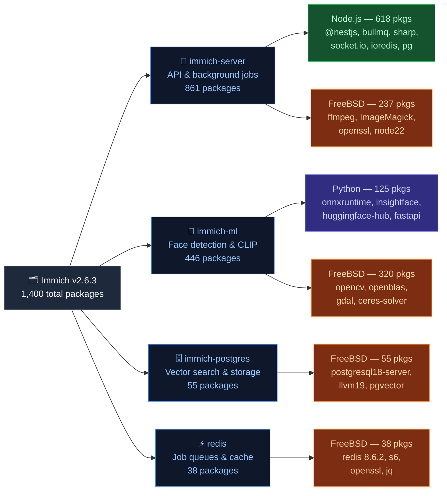

**There is a distinct, visceral satisfaction in typing `make config && make install clean`.**

If you've spent any meaningful amount of time in the Unix world, you know exactly what I mean. The FreeBSD Ports tree is an ethos—a commitment to understanding exactly what is running on your metal.

But let's be honest: while Ports are a masterpiece for traditional software, they hit a brick wall with modern, cloud-native applications. I've been running into this wall a lot lately while building **[daemonless.io](https://daemonless.io)**—a project dedicated to bringing first-class, native OCI images to FreeBSD.

Take **Immich**, a phenomenal photo backup app. It isn't a single binary. It's a sprawling ecosystem of Node.js, Python, ML microservices, PostgreSQL, and Redis — **1,400 packages across four container images**, as you can see in the dependency tree below:

Deploying this natively via Ports isn't just a dependency Whac-A-Mole for the maintainer—it's a configuration nightmare for the end user.

### The Anatomy of a Packaging Nightmare

Imagine you just want to back up your photos. Instead, you spend an evening doing all of this:

- Wrestle with Node.js version conflicts across the system
- Manually wire up four separate RC scripts
- Initialize a PostgreSQL database with the right extensions
- Configure a Redis socket and hope nothing else owns it
- Hope the Python version `onnxruntime` demands doesn't clash with something else on your system
- Hunt down config files scattered across four different corners of `/usr/local/etc`
- When something breaks—and something will—know enough about NestJS, pgvector, *and* the Ports tree to even begin diagnosing it
- Do all of it again when Immich ships a major update three months later

That's not a port. That's a part-time job.

"Just throw it in a thick jail," I hear you say. And yes, jails are one of FreeBSD's crown jewels—excellent for isolation. But a jail only solves *containment*. You still have to get all 1,400 packages *into* it, pin their versions, manage their interdependencies, and repeat that work every time Immich ships an update.

> The jail gives you a fence. It doesn't give you a package.

For sprawling modern web stacks, the container *is* the distribution format. OCI bundles an application with its exact, idiosyncratic userland dependencies, versioned and reproducible. **That completely neutralizes the packaging nightmare—for the maintainer and the end user alike.**

But historically, FreeBSD users had to pay a steep price for this convenience: spinning up a heavy Linux VM (like bhyve) just to run a Docker daemon. You lose the elegance of the native OS and waste hardware resources.

We shouldn't have to compromise our host OS just to run modern software.

### Addressing the "Linux Stuff" Elephant

I'll be honest—I've seen the pushback:

> *"That's Linux stuff. Get that Docker crap off my FreeBSD system."*

And I get it. That instinct comes from a good place: a hard-won pride in the platform and a healthy skepticism of importing foreign complexity. When OCI first arrived on the scene, it was Linux-centric, and the tooling made no bones about it.

But I'd push back on the framing. **OCI is a *standard*, not a Linux feature—the same way TCP/IP isn't a Linux feature just because Linux runs a lot of servers.** The container ecosystem has matured, and FreeBSD now has genuinely native tooling to run OCI workloads without a Linux kernel in sight. Rejecting that entirely means ceding modern application deployment to other platforms and leaving FreeBSD users to choose between a painful manual install or spinning up a Linux VM.

There is absolutely room for both worlds here. Ports and `pkg` are irreplaceable—they are the right tool for system software, daemons, libraries, and anything that belongs to the host. Native OCI fills the gap for application-layer software that was simply never going to land in the Ports tree. It's not either/or. It's knowing which tool fits the job.

### The Future: Native OCI on FreeBSD

The OCI (Open Container Initiative) standard is more than just "Docker"—it is the modern distribution format for the cloud-native world. It is how we bridge the gap between FreeBSD's legendary stability and the rapid-fire development of modern software.

By embracing native OCI images, we can leverage the standardized, frictionless packaging of the entire container world, but execute it natively using FreeBSD's superior isolation technologies. Tools like Podman (via ocijail) and AppJail don't emulate Linux—they map OCI image layers directly onto ZFS datasets and run them as native FreeBSD jails. You get immutable, snapshotable, copy-on-write container storage backed by the same filesystem primitives you already trust for your data. No heavy daemons, no Linux VM overhead—just native execution.

We don't have to choose between the purity of the Ports tree and the utility of modern software. `pkg` and Ports will always rule the base system and infrastructure. But for the sprawling ecosystems of modern web applications, native OCI is the clear path forward.

That's why I'm building **[daemonless.io](https://daemonless.io)**—to ensure FreeBSD has a seat at the table in this new era of container-first distribution. If you want to help test images, contribute, or just talk about the future of native containers on FreeBSD, jump into the Discord. Let's build something great.
